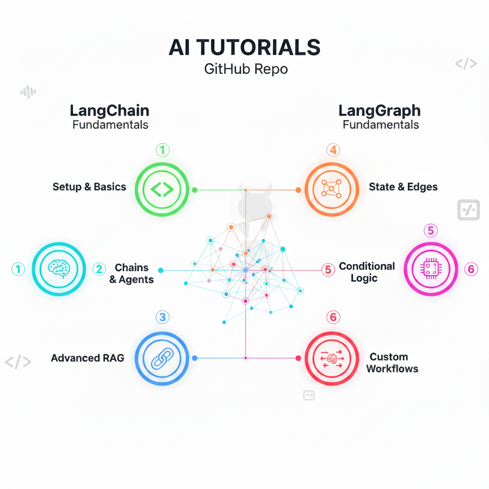

# LangChain & LangGraph Tutorials with Gemini

<div align="center">
  
</div>

**Complete hands-on tutorials for building AI applications with LangChain and LangGraph using Google Gemini models.**

Learn how to create sophisticated AI applications from basic LLM calls to complex multi-agent workflows. This repository provides step-by-step tutorials covering everything from prompt engineering to building stateful conversational agents with advanced tool integration.

## 🎯 What You'll Learn

- **LangChain Fundamentals**: API setup, prompt templates, chains, and streaming
- **LangGraph Workflows**: State management, conditional routing, and agent patterns
- **Google Gemini Integration**: Leveraging the latest AI models from Google
- **Production Patterns**: Monitoring, observability, and best practices

## 📋 Prerequisites

- Python 3.11+
- Conda (Anaconda or Miniconda)
- Google API key for Gemini models
- Langfuse keys (get free keys [here](https://langfuse.com/))

## 🚀 Installation

### 1. Create Virtual Environment with Conda

```bash
# Create a new conda environment with Python 3.11
conda create -n gcp-genai python=3.11

# Activate the environment
conda activate gcp-genai
```

### 2. Install Dependencies

```bash
# Install required packages
pip install langchain-google-genai langchain-core python-dotenv
```

### 3. Configuration

Create a `.env` file in the project root and add your Google API key:

```bash
cp .env.template .env
```

Fill the keys:
```env
# Required
GOOGLE_API_KEY=XXX

# Optional
LANGFUSE_PUBLIC_KEY=XXX
LANGFUSE_SECRET_KEY=XXX
LANGFUSE_HOST=https://cloud.langfuse.com
```

## 💻 Usage in local

```bash
# Activate the conda environment
conda activate gcp-genai

# Run any script
# Run LangChain fundamentals
python scripts/01_langchain_fundamentals/01_first_llm_call.py
python scripts/01_langchain_fundamentals/02_prompt_templates.py
python scripts/01_langchain_fundamentals/03_message_types.py
python scripts/01_langchain_fundamentals/04_structured_outputs.py
python scripts/01_langchain_fundamentals/05_simple_chains.py
python scripts/01_langchain_fundamentals/06_multimodal_inputs.py
python scripts/01_langchain_fundamentals/07_streaming_responses.py

# Run LangGraph tutorials
python scripts/02_langgraph/01_langgraph_basics.py
python scripts/02_langgraph/02_tool_calling.py
python scripts/02_langgraph/03_react_prebuilt_agent.py
python scripts/02_langgraph/04_langfuse_callback_handler.py
```

## 📁 Project Structure

```
LangChain-LangGraph-Tutorials/
├── 📁 assets/                       # Project images and assets
│   └── ai_tutorial.png
│
├── 📁 notebooks/                    # Google Colab notebooks
│   ├── 📁 01_langchain_fundamentals/
│   │   ├── 01_first_llm_call.ipynb
│   │   ├── 02_prompt_templates.ipynb
│   │   ├── 03_message_types.ipynb
│   │   ├── 04_structured_outputs.ipynb
│   │   ├── 05_simple_chains.ipynb
│   │   ├── 06_multimodal_inputs.ipynb
│   │   └── 07_streaming_responses.ipynb
│   └── 📁 02_langgraph/
│       ├── 01_langgraph_basics.ipynb
│       ├── 02_tool_calling.ipynb
│       ├── 03_react_prebuilt_agent.ipynb
│       └── 04_langfuse_callback_handler.ipynb
│
├── 📁 scripts/                      # Local Python scripts
│   ├── 📁 01_langchain_fundamentals/
│   │   ├── 01_first_llm_call.py
│   │   ├── 02_prompt_templates.py
│   │   ├── 03_message_types.py
│   │   ├── 04_structured_outputs.py
│   │   ├── 05_simple_chains.py
│   │   ├── 06_multimodal_inputs.py
│   │   └── 07_streaming_responses.py
│   └── 📁 02_langgraph/
│       ├── 01_langgraph_basics.py
│       ├── 02_tool_calling.py
│       ├── 03_react_prebuilt_agent.py
│       └── 04_langfuse_callback_handler.py
│
├── 📄 .env.template                 # Environment variables template
├── 📄 requirements.txt              # Python dependencies
└── 📄 README.md                     # This file
```

## 📚  Usage in Google Colab

| # | Title | Key Concepts | Google Colab Link |
|---|-------|-------------|------------------|
| **LANGCHAIN FUNDAMENTALS** | | | |
| 1 | First LLM Call | API setup, ChatGoogleGenerativeAI, invoke(), temperature, max_tokens, model comparison | [](https://colab.research.google.com/drive/1JnCNalb0J3kxROKjmYPlojVxILMzXER9) |
| 2 | Prompt Templates | PromptTemplate, ChatPromptTemplate, input variables, template formatting, system/human messages | [](https://colab.research.google.com/drive/12j1Y1wtBInrXzz4mwSq40SEF931rj7sY) |
| 3 | Message Types | HumanMessage, AIMessage, SystemMessage, message roles, conversation structure | [](https://colab.research.google.com/drive/19w2vm7Keed24Mte6xOWLiu5hZc60ds69) |
| 4 | Structured Outputs | Pydantic models, BaseModel, type validation, structured data extraction, JSON parsing | [](https://colab.research.google.com/drive/17KUIgiIc04KXFt-XWM8pcE53a6HwqcLF) |
| 5 | Simple Chains | LCEL (pipe operator), chain composition, RunnablePassthrough, data flow | [](https://colab.research.google.com/drive/1FuDhRp0csZfutFb4c9a7OjKayJdeN8ai) |
| 6 | Multimodal Inputs | Image processing, base64 encoding, vision models, multimodal prompts | [](https://colab.research.google.com/drive/1oYa0xWELAZ2ip3cD24OFxU3ORMQ_da1L) |
| 7 | Streaming Responses | Real-time streaming, AIMessageChunk, chunk aggregation, streaming chains | [](https://colab.research.google.com/drive/1qlb2fKoc3uwrCnQgZ6mnZbsqurroatXN) |
| **LANGGRAPH FUNDAMENTALS** | | | |
| 1 | LangGraph Basics | StateGraph, TypedDict, nodes, edges, conditional routing, state persistence | [](https://colab.research.google.com/drive/1xdA5_zYkXWcwze2PMIb-yJuMoWRXAS3-) |
| 2 | Tool Calling | Tool definitions, function calling, StructuredTool, tool integration, parameter validation | [](https://colab.research.google.com/drive/1Dh0wzVdkCvbHfgYTxxMK1kkmeZ9uisGg) |
| 3 | ReAct Prebuilt Agent | ReAct pattern, create_react_agent, agent executor, reasoning and acting, tool selection | [](https://colab.research.google.com/drive/1ZTe4El5fgTs6ExzE5qRj9nP-AQdO4-9_) |
| 4 | Langfuse Callback Handler | Observability, tracing, callback handlers, monitoring, performance tracking | [](https://colab.research.google.com/drive/1gkkSirDi3E_I6ojuEKnHiLaTTaOA7S42) |

### 📋 How to Use the Notebooks

1. **Click the "Open In Colab" badge** to open the notebook directly in Google Colab
2. **Run the first cell** to install the required dependencies
3. **Configure your Google API key** by creating a `.env` file or using Colab secrets
4. **Follow the exercises** step by step in each notebook

### 🔑 Notebook Prerequisites

- Google account to access Colab
- Google Gemini API key (free at [Google AI Studio](https://makersuite.google.com/app/apikey))
- Basic Python knowledge
